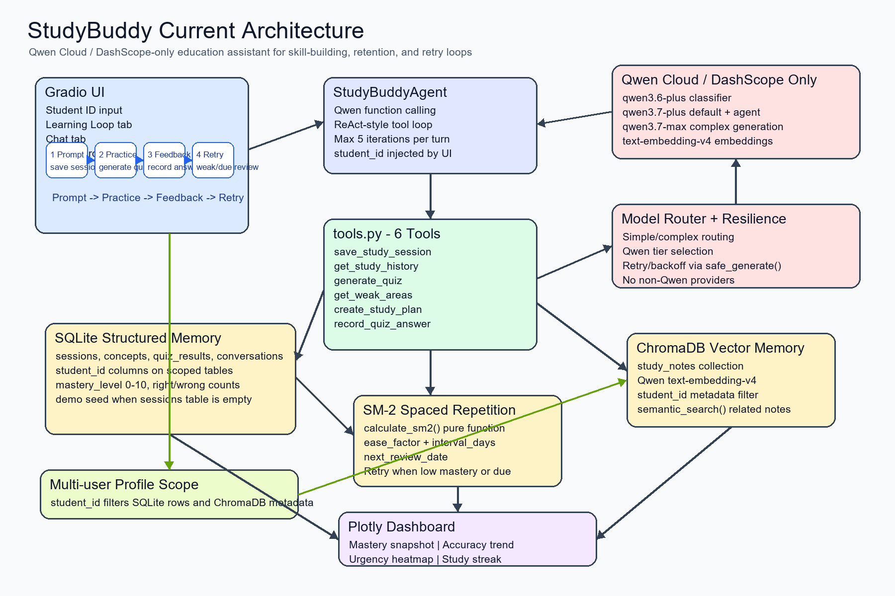

# 🎓 StudyBuddy

**An AI study assistant that remembers what you've learned, tracks your mastery, and guides you through a visible Prompt → Practice → Feedback → Retry loop — so you build real retention, not just familiarity.**

---

## The Problem

Students study once, feel confident, and then forget before they ever retrieve the material. A generic AI chatbot can explain a topic, but it does not know which concepts *you* have studied, which answers *you* got wrong, or which concepts are *due* for review right now.

The result? Students waste time re-reading what they already know, skip what they don't, and never build the retrieval strength that turns short-term exposure into lasting skill.

## The Solution

StudyBuddy is a **Qwen Cloud–powered** study assistant built around one explicit skill-building loop:

```
Prompt → Practice → Feedback → Retry
```

Every interaction feeds a **two-tier persistent memory** (SQLite + ChromaDB) that tracks each student's concept mastery, quiz history, and spaced-repetition schedule. The assistant doesn't just answer questions — it remembers, personalizes, and pushes the student toward measurable improvement.

---

## Feature Highlights

### 🔐 Authentication and Multi-User Profiles

StudyBuddy includes a **real authentication system** — not just a name field:

- **Signup / Login** with PBKDF2-SHA256 hashed passwords and per-user salts stored in SQLite
- **Demo account** (`demo_student` / `demo123`) with a one-click "Demo Login" button for instant access
- **Session persistence** across page refresh via Gradio `BrowserState`
- **Full profile isolation** — every query, concept, quiz result, conversation, learning path, and dashboard is scoped to the authenticated `student_id`

### 🔄 Learning Loop Tab — The Core Workflow

A guided **4-step workflow** with expandable accordions and a dynamic progress indicator:

| Step | What Happens |
|---|---|
| **1. Prompt** | Log a study session — topic, concepts, notes — into persistent memory and vector search |
| **2. Practice** | Generate quiz questions from *this student's* actual study history |
| **3. Feedback** | Record answers, update mastery (0–10 scale), and adjust SM-2 review schedules |
| **4. Retry** | Surface weak areas and due-for-review concepts with personalized retry guidance |

**Personalized Practice** buttons let students jump directly to:
- **"Practice Weak Areas"** — concepts ranked by lowest mastery and most wrong answers
- **"Due for Review"** — concepts whose SM-2 spaced-repetition date has arrived

### 💬 Chat Tab — Natural Language AI Tutor

- Full conversational agent with **Qwen function calling** across 6 tools
- **Tutor Mode toggle** — when enabled, the agent wraps every message with step-by-step explanatory framing
- **Collapsible Learning Stats sidebar** showing session count, topic count, quiz accuracy, and concept list
- **Conversation history** persisted per student and restored on login

### 📊 Dashboard Tab — Visual Analytics

Four interactive Plotly charts plus a detailed assessment table, all scoped to the logged-in student:

- **Concept Mastery Snapshot** — bar chart of mastery levels across all studied concepts
- **Quiz Accuracy Trend** — running accuracy over time to show improvement trajectory
- **Review Urgency Heatmap** — which concepts need attention *right now*
- **Study Streak Tracker** — consecutive study days to reinforce habit formation
- **Assessment section** — sortable concept details table with mastery, correct/wrong counts, and next review dates

### 🛤️ Learning Paths Tab — AI-Generated Study Plans

- Enter a **learning goal** and **timeframe** → receive a personalized 14-day plan
- Plans are generated using the student's **priority concepts** (low mastery + overdue) and all studied topics
- Every generated path is **persisted to SQLite** and survives page refresh
- **"Saved Learning Paths"** panel shows previous plans with timestamps for easy reload
- Loading indicator during generation so the UI stays responsive during the 10–30 second LLM call

---

## Architecture Overview




### Two-Tier Memory

| Layer | Technology | Purpose |
|---|---|---|
| **Structured** | SQLite (`memory_sqlite.py`) | Sessions, concepts (mastery 0–10), quiz results, conversations, users, learning paths |
| **Semantic** | ChromaDB (`memory_vector.py`) | Study notes embedded with Qwen's `text-embedding-v4` for meaning-based retrieval |

Both layers enforce **`student_id` scoping** on every read and write — no data leaks between profiles.

### SM-2 Spaced Repetition

`spaced_repetition.py` implements the SM-2 algorithm. Correct answers increase review intervals; incorrect answers reset them and lower ease factors. Scheduling fields (`ease_factor`, `interval_days`, `review_count`, `next_review_date`) are persisted per concept in the SQLite `concepts` table.

### Model Routing and Resilience

- `model_router.py` classifies requests by complexity and routes to Qwen model tiers (`qwen3.6-plus` for simple classification, `qwen3.7-plus` for standard tasks, `qwen3.7-max` for complex generation)
- `resilience.py` wraps every LLM call with **exponential backoff retry** and returns safe failure messages instead of crashing the UI
- `agent.py` adds its own **tenacity retry** layer on API calls with up to 3 attempts and a 5-iteration tool-calling loop with graceful exhaustion

---

## Tech Stack

| Component | Implementation |
|---|---|
| Language | Python 3.10+ |
| Web UI | Gradio 4.x |
| LLM API | Qwen Cloud / DashScope via OpenAI-compatible SDK |
| Structured memory | SQLite via Python `sqlite3` |
| Vector memory | ChromaDB persistent client |
| Embeddings | Qwen `text-embedding-v4` |
| Charts | Plotly |
| Auth | PBKDF2-SHA256 + random salts (stdlib `hashlib`) |
| Retry / backoff | tenacity + local resilience wrapper |
| Environment | python-dotenv |

**Model constants** (centralized in `config.py`):

| Constant | Value |
|---|---|
| `QWEN_CLASSIFIER_MODEL` | `qwen3.6-plus` |
| `QWEN_DEFAULT_MODEL` | `qwen3.7-plus` |
| `QWEN_COMPLEX_MODEL` | `qwen3.7-max` |
| `QWEN_AGENT_MODEL` | `qwen3.7-plus` |
| `QWEN_EMBEDDING_MODEL` | `text-embedding-v4` |

---

## Quick Start

## Live production development URL:

check on below link:

https://maria1192-studybuddy.hf.space

Demo username:Salman

Demo password:123456

Quick Demo 
Username:demo_student 
Password:demo123

Note: Please use this credentials for quick demo. You can also create your own account by clicking on the signup button.


## Local Development steps:

### 1. Install dependencies

```powershell
pip install -r requirements.txt
```

### 2. Configure environment

```powershell
copy .env.example .env
```

Edit `.env`:

```env
QWEN_API_KEY=your_dashscope_key_here
QWEN_BASE_URL=https://dashscope-intl.aliyuncs.com/compatible-mode/v1
DB_PATH=studybuddy.db
CHROMA_PATH=chroma_db
```

`DB_PATH` and `CHROMA_PATH` default to the values shown if omitted.

### 3. Run the app

```powershell
python main.py
```

The app launches at **http://127.0.0.1:7860**. On first run, `main.py` seeds realistic demo data (study sessions, concepts, quiz results) so the dashboard is never empty on startup.

Demo username:Salman

Demo password:123456

Quick Demo 
Username:demo_student 
Password:demo123

Note: Please use this credentials for quick demo. You can also create your own account by clicking on the signup button.

### 4. Verify connectivity (optional)

```powershell
python cloud_proof.py
python verify_connection.py
```

---

## Project Structure

```text
studybuddy/
├── .env.example                  # Environment variable template
├── .gitignore                    # Runtime/cache exclusions
├── LICENSE                       # MIT license
├── README.md                     # This file
├── agent.py                      # ReAct-style Qwen function-calling agent
├── architecture_diagram.png      # Architecture diagram
├── auth.py                       # Signup/login with hashed passwords
├── cloud_proof.py                # Qwen Cloud connectivity proof script
├── config.py                     # Env vars and Qwen model constants
├── eval_results.json             # Latest evaluation raw data
├── eval_skill_building.py        # Stateless-vs-StudyBuddy evaluation harness
├── main.py                       # Entry point, env validation, demo seeding
├── memory_sqlite.py              # SQLite memory layer (6 tables, student_id scoping)
├── memory_vector.py              # ChromaDB vector memory with semantic search
├── model_router.py               # Complexity-based Qwen tier routing
├── requirements.txt              # Python dependencies
├── resilience.py                 # Retry/backoff and safe generation wrapper
├── spaced_repetition.py          # SM-2 scheduling engine
├── tools.py                      # 6 tool schemas and dispatcher
├── ui.py                         # Gradio UI: auth, 4 tabs, guided workflow
├── verify_connection.py          # Qwen model and embedding connectivity check
├── visualizations.py             # Plotly dashboard chart functions
├── test_agent.py                 # Agent workflow test
├── test_agent_patch.py           # Agent persistence/retry wiring checks
├── test_memory_sqlite.py         # SQLite memory smoke test
├── test_memory_vector.py         # ChromaDB memory smoke test
├── test_model_router.py          # Model routing test
├── test_resilience.py            # Retry/error-classification test
├── test_spaced_repetition.py     # SM-2 workflow test
├── test_tools.py                 # Tool integration test
└── test_visualizations.py        # Chart and streak tests
```

Runtime artifacts (`.env`, `studybuddy.db`, `chroma_db/`, `__pycache__/`) are intentionally excluded from version control.

---

## Evaluation Methodology and Current Results

[`eval_skill_building.py`](eval_skill_building.py) runs **15 scenarios** across 11 subjects (Python, Algebra, Biology, Calculus, Chemistry, Spanish, Statistics, Computer Networks, World History, Physics, Essay Writing, Data Structures, Economics, SQL, Anatomy). Each scenario compares two response paths:

1. **Stateless baseline** — a Qwen call with *no* stored learner history (a plain LLM with no memory)
2. **StudyBuddy pipeline** — a Qwen call with simulated StudyBuddy memory context containing the student's weak concept (mastery 0, 0 correct, 3 wrong), a stronger concept (mastery 7, 7 correct, 0 wrong), and priority rankings

### Strict Scoring Criteria

The scorer does **not** reward generic educational language. A response passes only if:

- It names the **exact target concept** from the scenario's memory context, AND
- It includes a **stored evidence number** (mastery level, times correct, or times wrong) within a short token window of that concept name

This proximity-based evidence check ensures the response is grounded in the student's actual stored state, not just mentioning the topic in passing.

### Latest Results

| Metric | Result |
|---|---:|
| Stateless baseline | **1 / 15** |
| StudyBuddy pipeline | **9 / 15** |

**Interpretation:** Under this strict standard, StudyBuddy correctly surfaces stored evidence in **9 of 15** scenarios. The stateless baseline — which has no access to any student history — passes only **1 of 15** (a coincidental mention of "3" near the concept name in a generic response). The 6× gap demonstrates that persistent memory and explicit skill-building language produce measurably better evidence-grounded responses.

**6 scenarios still did not pass.** This is a real, measured, non-perfect result — not manufactured or cherry-picked. The failing scenarios tend to involve longer responses where the evidence number is buried further from the concept name, or where the model paraphrases rather than citing the stored number directly. Raw scenario-level data is in [`eval_results.json`](eval_results.json).

---

## Education Features Covered

| Feature | Where It Lives |
|---|---|
| Personalized practice and feedback | Learning Loop tab, `record_quiz_answer` tool |
| Tutoring (step-by-step explanations) | Chat tab Tutor Mode toggle |
| Learning path generation | Learning Paths tab, `create_study_plan` tool |
| Assessment and progress tracking | Dashboard tab, Plotly charts + concept details table |
| Spaced repetition scheduling | `spaced_repetition.py` SM-2 engine |
| Weak area identification | `get_weak_areas` tool + priority concept ranking |
| Targeted review of due concepts | "Due for Review" button in Learning Loop |

---

## What We Found and Fixed

- **Evaluation false positives** — The original keyword-count scorer awarded generic educational language, inflating both baseline and system to 11/15. Replaced with a strict proximity-based evidence scorer that requires stored numbers near concept names.
- **Stale provider references** — Removed all non-Qwen and prior-hackathon references; code and documentation now describe the current Qwen Cloud–only implementation.
- **Profile leakage** — Previous memory queries were global. All SQLite, ChromaDB, tool, agent, and dashboard functions now enforce `student_id` scoping.
- **Implicit learning loop** — The loop existed in backend behavior but wasn't visible. Added a dedicated Learning Loop tab with explicit Prompt → Practice → Feedback → Retry accordions.
- **Empty fresh-start state** — Fresh deployments showed an empty dashboard. `main.py` now seeds realistic demo data on first run.
- **Windows console encoding** — Tests could fail printing Unicode on Windows. Fixed with UTF-8 stdout configuration.

---

## Future Work

- **Close the 6-scenario gap** — 6 of 15 scenarios still do not surface explicit stored evidence. Closing this gap (e.g., by testing whether these 6 cases share a common pattern, such as longer responses that bury the number further from the concept name) is a specific, scoped next step.
- **Deterministic answer grading** — The guided UI currently uses simple text containment for direct answer checks, while the chat agent uses model judgment for paraphrases. A more robust grader would improve consistency.
- **More precise concept mapping** — Quiz answers update the concept/topic passed into `record_quiz_answer`; future work could map each quiz question to a narrower concept automatically.
- **Automated artifact cleanup** — Visualization and vector-memory tests can generate local files; future test harness work could isolate and clean them more consistently.

---

## License

MIT License. See [`LICENSE`](LICENSE).


Hugging face Metrics for StudyBuddy:
---
title: Studybuddy
emoji: 🐠
colorFrom: green
colorTo: purple
sdk: gradio
sdk_version: 6.26.0
python_version: '3.12'
app_file: app.py
pinned: false
license: mit
short_description: AI study assistant with persistent memory
---


